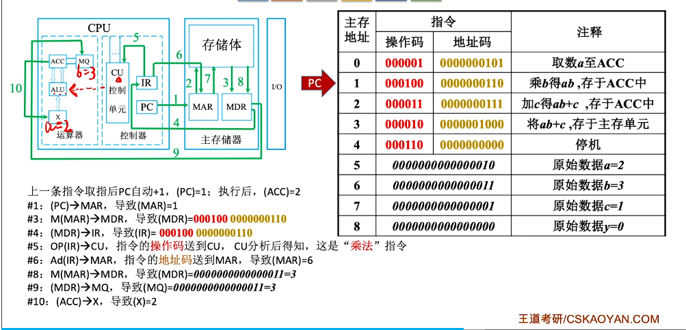

计算机组成原理-第1章绪论和感悟

个人感悟

本次课程的学习我真正理解了磁阵是磁盘阵列。就像电脑只有1个磁盘，多个磁盘共同作用组成阵列，根据RAID1、0、5、6等设计防止数据丢失同时高效率使用磁盘。

RAM随机访问存储，相对磁带这种顺序访问存取，才有了SRAM、DRAM；ROM是非易失存储。

SATA和SCSI等和USB一样都是一种总线协议，包括PCIe技术，这只是存储结构需要外部总线把数据送入主存，本质是一种协议。

固态硬盘SSD是闪存的原理存储数据，磁盘是根据磁性特点存储的，均按“块”存储。

为什么计算机中小数叫做浮点数？因为小数点可以浮动。

课程有关于汇编语言学习，包括如何把高级语言翻译为汇编语言、如何阅读汇编语言，核心是一条语句对应一个指令。

指令的实现：控制器控制运算器，遵循“取指-间址-执行-中断”的流程。

控制器如何分析指令实现信号：通过逻辑表达式和电路对应，设计电路（硬布线控制器）。

DMA是I/O控制的一种，进而才有了今天的RDMA！

总之本次学习首先解答了很多疑惑，获得喜悦，搭建了知识框架，这是通过AI对话无法建立的；后续能够提出更多问题，弥补细节，但核心框架已在心中建立。

导论

相关关联学科与硬件定位：

- 软件类：C语言、数据结构、计算机网络、操作系统

- 硬件类：计算机组成原理（计组）

- 应用载体：计算机、手机等各类信息化设备

第一台计算机：ENIAC

早期冯诺依曼架构：EDVAC（核心是存储程序的思路）

现代计算机的结构

现代计算机以存储器为中心，核心组成：

- 输入设备

- 存储器

- 运算器

- 控制器

- 输出设备

补充说明：CPU包含运算器和控制器；主机包含CPU和主存储器；I/O设备即外部设备。

关键执行步骤解析：

- 初始状态：指令、数据存入主存，PC（程序计数器）指向第一条指令（单元0）

- #1：(PC)→MAR，导致(MAR)=0（MAR为地址寄存器，指明要访问的存储单元）

- #3：M(MAR)→MDR，导致(MDR)=000001 0000000101（MDR为数据寄存器，暂存读写数据）

- #4：(MDR)→IR，导致(IR)=000001 0000000101（IR为指令寄存器，存放当前执行指令）

- #5：OP(R)→CU，指令的操作码送到CU（控制单元），CU分析后得知是“取数”指令

- #6：Ad(R)→MAR，指令的地址码送到MAR，导致(MAR)=6

- #8：M(MAR)→MDR，导致(MDR)=0000000000000010

- #9：(MDR)→ACC，导致(ACC)=2（ACC为累加计数器，存放操作数和运算结果）

- 上一条指令取指后PC自动+1，执行完第一条指令后，(PC)=1，(ACC)=2，后续按此逻辑依次执行

各硬件部件核心功能（知识回顾与重要考点）

1. 主存储器

- 核心概念：存储元、存储单元、存储字、存储字长、地址

- MAR（地址寄存器）：用于指明要读/写哪个存储单元，其位数反映存储单元数量

- MDR（数据寄存器）：用于暂存要读/写的数据，其位数=存储字长

2. 运算器

- ACC（累加计数器）：存放操作数、运算的结果

- MQ（乘商寄存器）：进行乘、除法运算时使用

- X（通用寄存器）：存放操作数

- ALU（算数逻辑单元）：用电路实现各种算数运算、逻辑运算

3. 控制器

- PC（程序计数器）：存放下一条指令的地址

- IR（指令寄存器）：存放当前执行的指令

- CU（控制单元）：分析指令，给出控制信号，指挥其他部件执行指令

计算机层次结构

核心关系

- 硬件--系统软件--应用软件的关系：详见操作系统相关内容

- 语言层次：机器语言--汇编语言（需翻译程序）--高级语言（包括解释型和编译型）；C语言形成的.exe文件可直接在CPU运行

- 硬件与软件的等价性：指令集体系结构ISA定义软件与硬件的边界

计算机系统层次结构（从上层到下层）

1. 虚拟机器M4（高级语言机器）：用编译程序将高级语言（如y=a*b+c）翻译为汇编语言程序

2. 虚拟机器M3（汇编语言机器）：用汇编程序将汇编语言（如LOAD 5、MUL 6）翻译为机器语言程序

3. 虚拟机器M2（操作系统机器）：向上提供“广义指令”（系统调用）

4. 传统机器M1（用机器语言的机器）：执行二进制机器指令（如0000010000000101取数指令、000100000000010乘法指令）

5. 微程序机器M0（微指令系统）：由硬件直接执行微指令（如微指令1、微指令3、微指令7等）

核心原则：下层是上层的基础，上层是下层的扩展。

计算机性能指标

计算机的核心工作原理是“存储程序”，关键性能指标如下：

1. 存储器相关

- 存储器的容量：由MAR的位数（反映存储单元数量）和MDR的位数（反映每个存储单元大小）共同决定

2. CPU相关

- 时钟周期：CPU中最小的时间单位，每个动作至少需要1个时钟周期

- 主频（时钟频率）：=1/时钟周期，单位：Hz

- CPI：执行一条指令所需的时钟周期数

- CPU执行时间：运行一个程序所花费的时间，计算公式=（指令条数×CPI）/主频

- IPS：每秒执行多少条指令，计算公式=主频/平均CPI

- FLOPS：每秒执行多少次浮点运算

3. 其他性能指标

数据通路宽度、吞吐量、响应时间、基准程序

4. 常用数量单位

- 描述存储容量、文件大小时：K=2¹⁰，M=2²⁰，G=2³⁰，T=2⁴⁰

- 描述频率、速率时：K=10³，M=10⁶，G=10⁹，T=10¹²
