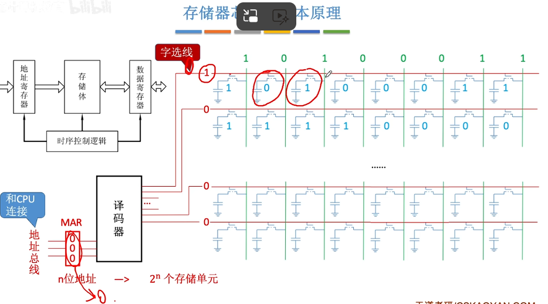
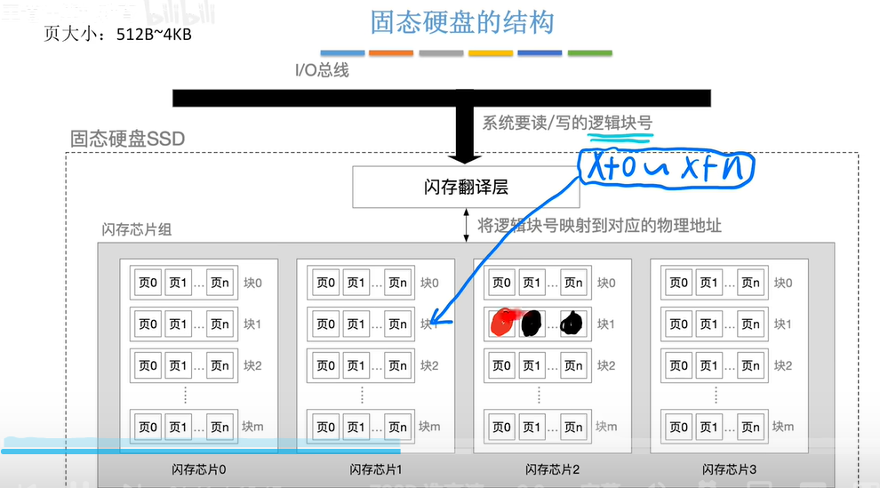

计算机组成原理-第3章存储

数据的存储和排序

大端和小端方式

多字节数据在内存中一定是占用连续的几个字节，大端和小端是两种不同的字节存储顺序：

- 大端方式：最高有效字节（MSB）存于低地址，最低有效字节（LSB）存于高地址，便于人类阅读

- 小端方式：最低有效字节（LSB）存于低地址，最高有效字节（MSB）存于高地址

示例：4字节int：01 23 45 67H（对应十进制19088743D）

- 大端存储（地址0800H~0803H）：01H、23H、45H、67H

- 小端存储（地址0800H~0803H）：67H、45H、23H、01H

边界对齐

现代计算机通常是按字节编址，即每个字节对应1个地址，同时也支持按字、按半字、按字节寻址。假设存储字长为32位，则1个字=32bit，半字=16bit，每次访存只能读/写1个存储单元。

存储器的层次结构

存储器层次结构核心是利用“速度-容量-价格”的权衡，解决CPU与主存、主存与辅存的性能匹配问题，从CPU到外存，速度逐渐变慢、容量逐渐变大、价格逐渐降低：

- CPU内部：寄存器（最快、最小、最贵）

- 高速缓冲存储器（Cache）：速度仅次于寄存器，用于解决CPU与主存速度不匹配问题

- 主存储器（主存、内存）：核心存储，CPU可直接访问

- 辅助存储器（辅存、外存）：如磁盘、U盘、光盘、磁带（最慢、最大、最便宜），用于解决主存容量不足问题

注：有的教材把安装在电脑内部的磁盘称为“辅存”，把U盘、光盘等称为“外存”；也有的教材把磁盘、U盘、光盘等统称为“辅存”或“外存”。

存储器的分类（按存取方式）

- 随机存取存储器（Random Access Memory, RAM）：读写任何一个存储单元所需时间都相同，与存储单元所在的物理位置无关（如内存）。

- 顺序存取存储器（Sequential Access Memory, SAM）：读写一个存储单元所需时间取决于存储单元所在的物理位置（如磁带），属于串行访问存储器。

- 直接存取存储器（Direct Access Memory, DAM）：既有随机存取特性，也有顺序存取特性；先直接选取信息所在区域，然后按顺序方式存取（如磁盘），属于串行访问存储器。

- 相联存储器（Associative Memory, CAM）：即可以按内容访问的存储器，可按照内容检索到存储位置进行读写。

存储器分类与性能指标（知识回顾）

一、分类

- 按层次结构：Cache-主存层（解决速度不匹配）、主存-辅存层（解决容量不足）

- 按存储介质：半导体存储器、磁表面存储器、光存储器

- 按存取方式：RAM、SAM、DAM、CAM（相联存储器）

- 按信息可更改性：读/写存储器、只读存储器（ROM）

- 按断电后信息是否消失：易失性存储器（如内存、Cache）、非易失性存储器（如磁盘、光盘）

- 按信息读出后原信息是否被破坏：破坏性读出（如DRAM芯片）、非破坏性读出（如SRAM芯片、磁盘）

二、基本概念与性能指标

- 存储容量 = 存储字数 × 字长

- 单位成本（每位价格）= 总成本 / 总容量

- 数据传输率（主存带宽）= 数据的宽度 / 存储周期

- 存储周期 = 存取时间 + 恢复时间

存储器原理

主存储器的基本组成与存储芯片结构

- 基本元件：MOS管（作为通电“开关”，存储二进制1）、电容（存储电荷，存储二进制0）

- 译码驱动电路：译码器将地址信号转化为字选通线的高低电平

- 存储矩阵（存储体）：由多个存储单元构成，每个存储单元又由多个存储元构成

- 读写电路：每次读/写一个存储字

- 控制线：地址线、数据线、片选线、读写控制线（可能分开两根，也可能只有一根）

寻址方式

现代计算机通常按字节编址（每个字节对应一个地址），支持多种寻址方式：按字节寻址、按字寻址、按半字寻址、按双字寻址。

DRAM与SRAM与ROM

DRAM与SRAM对比

类型特点

SRAM（静态RAM）

DRAM（动态RAM）

存储信息

触发器

电容

破坏性读出

非

是

读出后需要重写？（再生）

不用

需要

运行速度

快

慢

集成度

低

高

发热量

大

小

存储成本

高

低

易失/非易失性

易失（断电后信息消失）

易失（断电后信息消失）

需要“刷新”？

不需要

需要

地址发送方式

同时送

分两次送（行列地址）

常用场景

常用作Cache

常用作主存

DRAM的刷新机制

- 刷新周期：一般为2ms

- 刷新单位：以行为单位，每次刷新一行存储单元

- 刷新原因：采用行列地址，减少选通线的数量

- 刷新方式：有硬件支持，读出一行的信息后重新写入，占用1个读/写周期

- 刷新时机（三种思路）：
        

  - 分散刷新：每次读写完都刷新一行，系统存取周期变为1us（原0.5us读写+0.5us刷新）

  - 集中刷新：2ms内集中安排时间全部刷新，存在访存“死区”（无法访问存储器的时间段）

  - 异步刷新：2ms内每行刷新1次，每隔15.6us（2ms/128行）刷新一行，无明显死区

ROM的分类及特点

- MROM（Mask Read-Only Memory）——掩模式只读存储器：厂家按客户需求，在芯片生产过程中直接写入信息，之后不可重写（仅可读）；可靠性高、灵活性差、生产周期长，适合批量定制。

- PROM（Programmable Read-Only Memory）——可编程只读存储器：用户可用专门的PROM写入器写入信息，写一次后不可更改。

- EPROM（Erasable Programmable Read-Only Memory）——可擦除可编程只读存储器：允许用户写入信息，可多次重写；UVEPROM用紫外线照射8~20分钟擦除所有信息。

- EEPROM（E²PROM）——电可擦除可编程只读存储器：用电擦除方式，可擦除特定的字；每个存储元只需单个MOS管，位密度比RAM高。

- Flash Memory——闪速存储器：在EEPROM基础上发展而来，断电后保存信息，可多次快速擦除重写；U盘、SD卡、手机辅存均使用闪存；写入速度比读取速度慢（需先擦除再写入）。

- SSD（Solid State Drives）——固态硬盘：由控制单元+存储单元（Flash芯片）构成，与闪存核心区别在于控制单元；速度快、功耗低、价格高，常取代传统机械硬盘。

注意：①很多ROM芯片虽名为“Read-Only”，但部分可“写”；②RAM芯片是易失性的，ROM芯片是非易失性的；③很多ROM也具有“随机存取”特性。

多模块存储器

多模块存储器通过并行存取提升主存速度，核心分为高位交叉编址和低位交叉编址两种方式，其中低位交叉编址应用更广泛。

核心特点

- 低位交叉编址：采用“流水线”方式并行存取（宏观并行，微观串行）；每个存储周期内，m体交叉存储器可提供的数据量为单个模块的m倍；当模块数m≥T/r（T为存储周期，r为存取时间）时，可使流水线不间断。

- 高位交叉编址：理论上多个存储体可并行访问，但因常连续访问，实际效果相当于单纯扩容。

其他提升主存速度的方式

- 双端口RAM：支持两个CPU同时访问；可同时读/写不同存储单元、同时读同一个单元；不能同时写（或一读一写）同一个单元，冲突时发出“BUSY”信号，关闭一个访问端口。

- 单体多字存储器：每次并行读出m个连续的字，总线宽度需扩展为m个字。

增加内存存储字长（位扩展与字扩展）

位扩展（增加存储字长）

示例：8片8K×1位的存储芯片，可组成1个8K×8位的存储器（容量8KB）；通过将各芯片的地址线、片选线、读写控制线对应连接，数据线分别连接到数据总线的不同位，实现位扩展。

字扩展（增加存储字数）

通过译码器实现片选，扩展存储单元的数量；示例：2片8K×8位的存储芯片，通过1-2译码器控制片选，可扩展为16K×8位的存储器。

片选方式对比

片选方式

特点

选片信号数量

地址空间

线选法

电路简单

n条线→n个选片信号

不连续

译码片选法

电路复杂

n条线→2ⁿ个选片信号

可连续

外存-磁盘

磁盘设备的组成

1. 存储区域

- 一块硬盘包含若干个记录面，每个记录面对应一个磁头（磁头数=记录面数）。

- 每个记录面划分为若干条磁道，不同记录面的相同编号磁道构成一个柱面（柱面数=每面磁道数）。

- 每条磁道划分为若干个扇区，扇区（块）是磁盘读写的最小单位，磁盘按块存取。

2. 硬盘存储器

由磁盘驱动器、磁盘控制器和盘片三部分组成。

磁盘的读写原理

核心流程：CPU通过总线发送并行数据和控制信号，经串-并变换电路转换为串行信号，由电流驱动器驱动读写磁头，在磁介质层进行数据读写；读取的数据经读放电路、并-串变换电路，返回总线。

磁盘阵列（RAID）

RAID（廉价冗余磁盘阵列）：将多个独立物理磁盘组成一个逻辑盘，数据在多个物理盘上分割交叉存储、并行访问，提升存储性能、可靠性和安全性；RAID1~RAID5中，受损磁盘可随时更换，数据不丢失。

常见RAID分级

- RAID0：无冗余、无校验，逻辑上相邻扇区存于不同磁盘（类比低位交叉编址），速度快但无容错能力。

- RAID1：镜像磁盘阵列，数据同步存储在两个磁盘，容错能力强。

- RAID2：采用海明码纠错，4bit信息位+3bit校验位，可纠正一位错。

- RAID3：位交叉奇偶校验，提升读写速度，有容错能力。

- RAID4：块交叉奇偶校验，独立校验盘，读写效率一般。

- RAID5：无独立校验盘，奇偶校验信息分散存储，综合性能优。

磁盘的性能指标

- 容量：分为格式化容量和非格式化容量。

- 记录密度：道密度、位密度、面密度。

- 平均存取时间：寻道时间（磁头移动到目标磁道）+ 旋转延迟时间（扇区转到磁头下方）+ 传输时间（读写数据）。

- 数据传输率：单位时间内读写的数据量。

- 磁盘地址：驱动器号 | 柱面（磁道）号 | 盘面号 | 扇区号。

固态硬盘SSD

SSD的原理与组成

- 原理：基于闪存技术（Flash Memory），属于电可擦除ROM（EEPROM）。

- 组成：闪存翻译层（负责翻译逻辑块号，映射到对应物理页）+ 多个闪存芯片（每个芯片包含多个块，每个块包含多个页）。

- 读写单位：以页（Page）为单位读写（相当于磁盘的扇区）；写入时需先擦除整个块，再写入新页。

SSD的结构

页大小通常为512B~4KB；系统发送逻辑块号，经闪存翻译层映射到物理地址，再通过闪存芯片组完成读写操作。

SSD的特点与磨损均衡

- 优势：读写速度快、随机访问性能高，通过电路控制访问位置（无机械部件）。

- 劣势：闪存块擦除次数有限（过度擦除会损坏），而机械硬盘扇区无此问题。

- 磨损均衡技术：将“擦除”平均分布在各个块上，提升使用寿命；静态磨损均衡：让老旧块承担读为主的任务，新块承担更多写任务，由SSD自动监测和数据迁移。

Cache（高速缓冲存储器）

Cache的核心是利用局部性原理，将CPU当前访问地址“周围”的数据存入Cache，减少CPU访问主存的次数，解决CPU与主存速度不匹配问题。

局部性原理

- 时间局部性：最近未来要用的信息，很可能是现在正在使用的信息（如循环结构的指令代码）。

- 空间局部性：最近未来要用的信息，很可能与现在正在使用的信息在存储空间上邻近（如数组元素、顺序执行的指令）。

示例：程序A按“行优先”访问二维数组，空间局部性好；程序B按“列优先”访问，空间局部性差。

Cache的性能分析（命中率）

- 命中率H：CPU欲访问的信息已在Cache中的比率。

- 缺失率M：M = 1 - H。

- 平均访问时间：设t₁为访问Cache的时间，t₂为访问主存的时间，则平均访问时间 = H×t₁ + (1-H)×t₂。

Cache和主存块之间的关系

核心包括三个方面：Cache与主存的映射关系、Cache满后的替换算法、Cache数据的写策略。

一、Cache与主存的映射关系

1. 全相联映射

- 核心：主存块可以放在Cache的任意位置。

- 主存地址结构：标记（整个主存块号）+ 块内地址。

- 访存过程：CPU访问地址的标记位，对比Cache中所有块的标记，若匹配且有效位=1，则命中，访问块内地址；否则未命中，访问主存。

- 优缺点：存储空间利用充分，命中率高；但查找标记最慢，需对比所有行。

2. 直接映射

- 核心：每个主存块只能放到一个特定的Cache行，行号 = 主存块号 % Cache总块数。

- 主存地址结构：标记（主存块号前几位）+ 行号（主存块号末几位）+ 块内地址。

- 访存过程：根据行号找到对应Cache行，对比标记位，匹配且有效位=1则命中。

- 优缺点：查找速度最快（只需对比一个标记）；但存储空间利用不充分，命中率低。

3. 组相联映射

- 核心：主存块可以放到特定分组中的任意一个位置，所属组号 = 主存块号 % 分组数（n路组相联：每n个Cache行为一组）。

- 主存地址结构：标记（主存块号前几位）+ 组号（主存块号末几位）+ 块内地址。

- 优缺点：全相联与直接映射的折中，综合效果较好。

映射关系总结

Cache中存储的信息：有效位（0/1）+ 标记 + 整块数据；标记位数随映射方式不同而变化。

二、Cache的替换算法

- 随机算法（RAND）：随便选一个主存块替换，过于随意，效果很差。

- 先进先出算法（FIFO）：优先替换最先被调入Cache的主存块；不遵循局部性原理，效果差；频繁换入换出现象称为“抖动”。

- 近期最少使用算法（LRU）：替换最久没有被访问过的主存块；基于局部性原理，每个Cache行设计数器记录未访问时间，命中率最高，实际效果优秀。

- 最不经常使用算法（LFU）：替换被访问次数最少的主存块；每个Cache行设计数器记录访问次数，曾经频繁访问的块未来不一定使用，实际效果不好。

三、Cache的写策略

1. 写命中（CPU对Cache写命中时）

- 全写法（写直通法，write-through）：同时写入Cache和主存，一般搭配写缓冲，避免CPU等待主存写入；优点是数据一致，缺点是访存次数多。

- 写回法（write-back）：只修改Cache内容，不立即写入主存；当该块被替换时，才写回主存；优点是减少访存次数，缺点是存在数据不一致隐患（需标记“脏块”，即被修改过的块）。

2. 写不命中（CPU对Cache写不命中时）

- 写分配法（write-allocate）：将主存中的块调入Cache，在Cache中修改；通常搭配写回法使用。

- 非写分配法（not-write-allocate）：只写入主存，不调入Cache；通常搭配全写法使用。

3. 多级Cache的写策略

现代计算机常采用多级Cache（L1、L2、L3），离CPU越近，速度越快、容量越小：

- 各级Cache之间：常采用“全写法 + 非写分配法”。

- Cache与主存之间：常采用“写回法 + 写分配法”。
